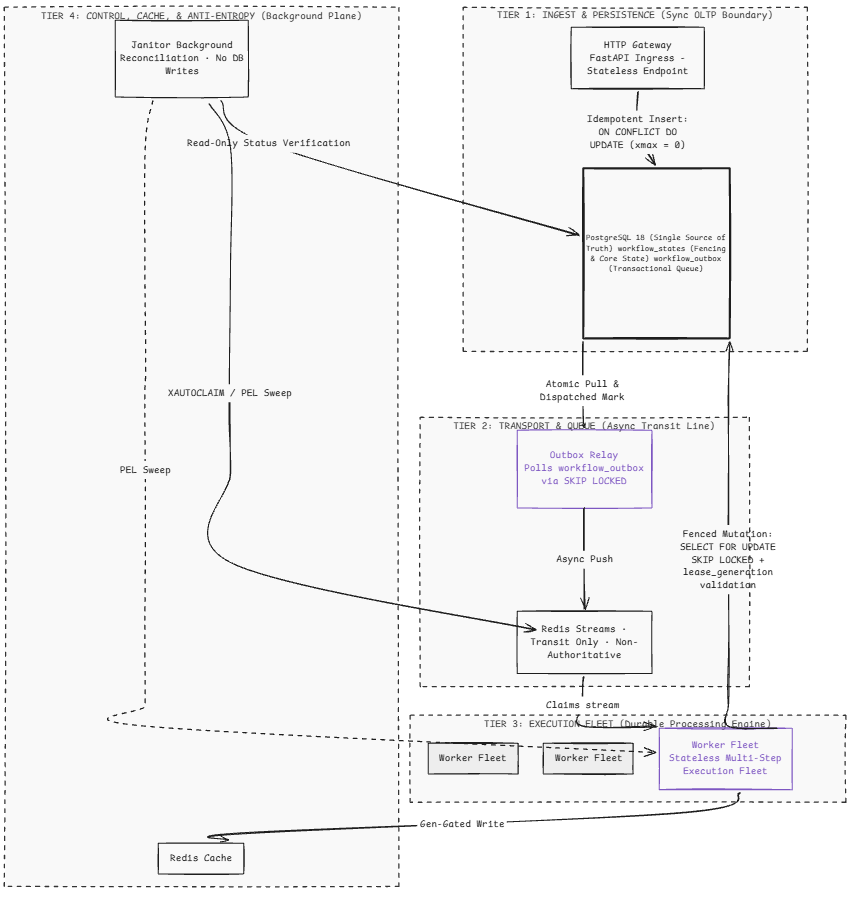

# Axiom

**A distributed, fault-tolerant orchestration engine for long-running AI workflows.**

Axiom exists for one specific, expensive problem: durable execution of multi-step LLM workflows where a crash, a network blip, or a superseded worker must never mean lost state, a duplicated side effect, or — worst case — a duplicated LLM bill. Every mechanism here is built and tested against that guarantee, not bolted on after the fact.

This is a from-scratch implementation of the core primitives — outbox pattern, fencing tokens, lease-based reclaim, anti-entropy reconciliation — not a wrapper around an existing durable-execution platform. Temporal, Restate, and Inngest all solve versions of this problem well; the honest reasoning for building this instead of adopting one of them lives in [`docs/decisions.md`](docs/decisions.md), not in marketing copy here.

---

## Architecture at a glance



Axiom's layout isolates compute from state across a clear 4-tier processing plane to enforce total fault isolation and deterministic recovery loops:
- **Tier 1 (Ingest & Persistence):** The synchronous boundary where the stateless FastAPI ingress enforces inline idempotency via an atomic `ON CONFLICT DO UPDATE` write to PostgreSQL.
- **Tier 2 (Transport & Queue):** The asynchronous, non-blocking transit loop where an isolated Outbox Relay pops events using `SKIP LOCKED` and drops them opaquely into Redis Streams.
- **Tier 3 (Execution Fleet):** The distributed execution engine where horizontal worker nodes pull messages via consumer groups and run long-lived multi-step tasks.
- **Tier 4 (Control & Anti-Entropy):** A background loop where the Janitor sanitizes dangling or failed states without ever writing directly to the core state machines.

Postgres is the single source of truth for every workflow's state. Redis is transit and cache — never authoritative. No recovery path in this system trusts a component's own memory of what happened; every one of them re-derives truth from Postgres.

---

## What this actually guarantees

- **Exactly-once-effective execution, verified, not assumed.** Every worker claim uses `SELECT ... FOR UPDATE SKIP LOCKED` plus a fencing token (`lease_generation`) that makes a superseded worker's final write a guaranteed no-op — checked with a concurrent-claim test against a real Postgres instance, not just argued in a design doc.
- **Cost-safety as a first-class guarantee.** A worker that's been superseded mid-LLM-call is expected to detect it and abort the connection before the next token generates. A duplicated correctness bug is bad; a duplicated LLM bill is the one that gets escalated.
- **Anti-entropy instead of "it shouldn't happen."** A dedicated reconciliation sweep exists specifically because ACKs, cache writes, and status transitions can each independently fail. The system assumes partial failure at every boundary rather than hoping around it.
- **Cordon-and-drain versioning**, so a breaking workflow schema change doesn't require stopping the world — old and new workflow versions run side by side until the old version's in-flight jobs drain naturally.

---

## Project status

Built in verified layers — nothing in a later phase is trusted until the layer beneath it has real, passing tests against a real Postgres and Redis, not mocks.

| Phase | Component | Status |
|---|---|---|
| 0 | Project scaffolding, tooling, `contracts/` boundary | ✅ Done |
| 1 | Schema + Ingress (atomic idempotent write) | ✅ Done |
| 2 | Outbox Relay + versioned Redis Streams | 🟡 In progress |
| 3 | Worker Fleet (claim, fencing, heartbeat, cost-safety abort) | ⬜ Not started |
| 4 | Cache Projection + Janitor + retry scheduler | ⬜ Not started |
| 5 | API layer (status, cancellation, human-in-the-loop resume) | ⬜ Not started |
| 6 | Observability (metrics, alert thresholds, runbooks) | ⬜ Not started |
| 7 | IaC (Terraform) + live dashboard | ⬜ Not started |

---

## Getting started

**Prerequisites:** Docker + Docker Compose, Python 3.12+, [`uv`](https://docs.astral.sh/uv/)

```bash
# Postgres + Redis — schema auto-applies from migrations/ on first boot
docker compose up -d

# pyproject.toml declares intent (version ranges); uv.lock pins the exact
# resolved graph, so this installs identically on any machine
uv sync

# Runs against the real, running Postgres/Redis — not mocks
uv run pytest tests/ -v
```

---

## Project layout

```
axiom/
├── docs/
│   └── decisions.md        # the "why" behind every non-obvious choice
├── migrations/
│   └── 001_initial_schema.sql
├── src/axiom/
│   ├── config.py            # env-driven settings — see .env.example
│   ├── db.py                 # shared Postgres pool
│   ├── redis_client.py       # shared Redis client
│   ├── contracts/            # wire contracts only — enums, event/payload
│   │                         # schemas. Shared deliberately; see
│   │                         # docs/decisions.md for why this doesn't
│   │                         # reintroduce cross-component coupling.
│   ├── ingress/               # Phase 1 — HTTP gateway
│   ├── relay/                 # Phase 2 — outbox → stream dispatch
│   ├── worker/                # Phase 3 — claim / execute / fence
│   ├── cache/                 # Phase 4 — the read projection
│   ├── janitor/                # Phase 4 — PEL reconciliation
│   ├── scheduler/               # Phase 4 — retry / backoff
│   ├── api/                    # Phase 5 — public status / cancel / resume
│   └── observability/           # Phase 6 — metrics
└── tests/                       # mirrors src/axiom/ 1:1
```

---

## License

MIT — see [`LICENSE`](LICENSE). *(Not yet added to the repo — this is a proposed default, not a settled decision.)*