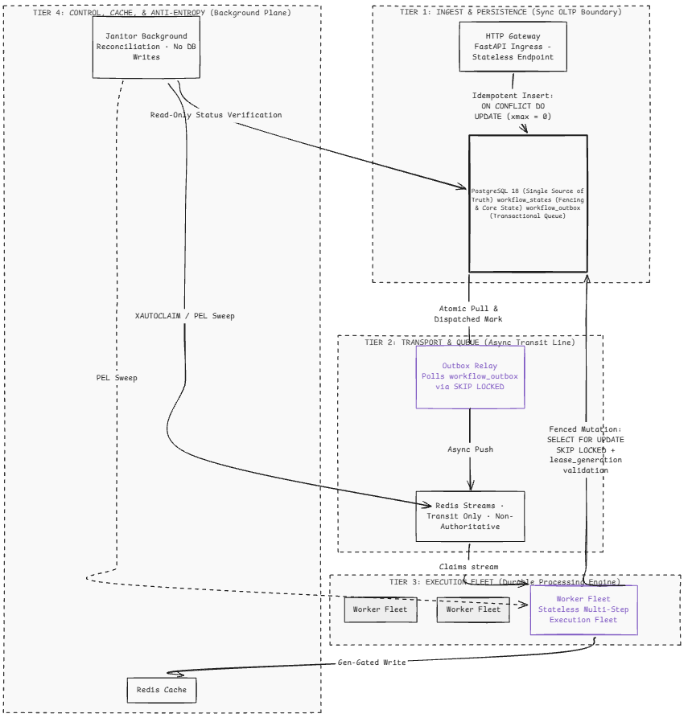

# Axiom

**A distributed, fault-tolerant orchestration engine for long-running AI workflows.**

Axiom exists for one specific, expensive problem: durable execution of multi-step LLM workflows where a crash, a network blip, or a superseded worker must never mean lost state, a duplicated side effect, or — worst case — a duplicated LLM bill. Every mechanism that exists here was built and tested against that guarantee rather than bolted on afterwards — and the parts not yet built are marked as such below rather than quietly implied.

This is a from-scratch implementation of the core primitives — outbox pattern, fencing tokens, lease-based reclaim, anti-entropy reconciliation — not a wrapper around an existing durable-execution platform. Temporal, Restate, and Inngest all solve versions of this problem well; the honest reasoning for building this instead of adopting one of them lives in [`docs/decisions.md`](docs/decisions.md), not in marketing copy here.

---

## Architecture at a glance



Axiom's layout isolates compute from state across a clear 4-tier processing plane to enforce total fault isolation and deterministic recovery loops:
- **Tier 1 (Ingest & Persistence):** The synchronous boundary where the stateless FastAPI ingress enforces inline idempotency via an atomic `ON CONFLICT DO UPDATE` write to PostgreSQL.
- **Tier 2 (Transport & Queue):** The asynchronous, non-blocking transit loop where an isolated Outbox Relay pops events using `SKIP LOCKED` and drops them opaquely into Redis Streams.
- **Tier 3 (Execution Fleet):** The distributed execution engine where horizontal worker nodes pull messages via consumer groups and run long-lived multi-step tasks.
- **Tier 4 (Control & Anti-Entropy)** — *specified, not yet built:* A background loop where the Janitor will sanitize dangling or failed states without ever writing directly to the core state machines.

Postgres is the single source of truth for every workflow's state. Redis is transit and cache — never authoritative. No recovery path in this system trusts a component's own memory of what happened; every one of them re-derives truth from Postgres.

---

## What this guarantees — and how far it's actually proven

Each entry is a design target followed by its real status. A project whose
thesis is "verified, not assumed" cannot have a front page that asserts
mechanisms it has not built, so the two are kept separate here rather than
blurred into one confident paragraph.

**✅ Exactly-once-effective execution — built and verified.**
Fencing is via `lease_generation`, enforced *at the row*: a superseded worker's
write carries a stale generation, matches zero rows, and is a guaranteed no-op.
The Worker's claim is a single-row conditional `UPDATE`, which deliberately does
**not** use `SKIP LOCKED` — under Read Committed, a blocked `UPDATE` re-evaluates
its `WHERE` clause once the competing transaction commits, so the loser correctly
affects zero rows on its own. `SELECT ... FOR UPDATE SKIP LOCKED` is used by the
Relay's *batch* claim, where many candidate rows are scanned. Both are checked by
concurrent tests against a real Postgres instance.

**✅ Multi-step composition — built and verified.**
A handler continues the chain by returning `NextStep(...)` instead of its
output. The worker completes the current workflow and creates the next one —
row plus outbox event — in a single transaction, so a crash can never leave a
chain that reads as successfully finished while the rest of the work silently
never ran. Each step is a full workflow with its own lease, retries and
dead-letter budget, which is what makes a retry replay one step rather than
the whole chain: on an LLM workload, replaying step 1 to recover step 2 means
paying for it twice. Runaway chains are bounded by a configured depth ceiling,
and a workflow that hits it fails loudly rather than dropping its successor.
Verified end to end through a real Relay and Worker, and the tests themselves
were checked by mutation — see `docs/decisions.md` #16.

**⚠️ Cost-safety — mechanism proven, provider behavior not.**
A superseded worker detects supersession between stream chunks and closes the
transport. That much is proven: measured against a real socket and observed from
the *server's* side, the close lands before the fencing error even surfaces.

One thing is explicitly **not** established, and is not claimed: whether a given
LLM provider actually stops generating — and stops billing — once we
disconnect. That is a property of someone else's infrastructure, it varies by
provider, and it is only measurable per-provider against a real one.

**✅ Pay once per call across re-runs — built and measured.**
Fencing stops a *superseded* worker from generating more tokens. It does
nothing about the *reclaiming* one, which re-runs the handler from the start
(`docs/decisions.md` #13) and re-issues every call the previous attempt already
paid for. This page used to name provider-side idempotency keys as the fix.
That was measured in August 2026 and is wrong — Mistral ignores
`Idempotency-Key` entirely, and no major provider documents an equivalent for
chat completions (`docs/decisions.md` #18) — so the record lives here instead.
A handler wraps each paid call in `memoized_call()`; the response is committed
to Postgres keyed by `(workflow_id, call_index)` and every later attempt reads
it back rather than calling out. Measured end to end against a real provider,
a workflow that fails twice after paying and then succeeds costs **206 tokens
without the memo and 61 with it** — three attempts, one bill.

The write is deliberately **unfenced**, unlike every other write in this
system: a superseded worker must still record what it spent, because the memo
the winner reads is usually the one the loser wrote.

It **narrows** the window rather than closing it, and is described that way on
purpose. A worker that dies between the provider committing the charge and the
memo committing still pays twice; that window is one Postgres write, measured
at p50 1.2ms / p95 1.8ms against a ~2.8s completion. Nor does it help two
workers running genuinely at once — only the sequential re-run reclaim
produces. It also
requires handlers to issue their calls in the same order every run; a handler
that breaks that assumption gets a loud `NonDeterministicHandlerError` rather
than a wrong answer.

**✅ Illegal state transitions are impossible — enforced at the database.**
The nine-state vocabulary was always constrained; the *edges between* those
states were not. Until migration 005, `UPDATE workflow_states SET
status='RUNNING'` on a `COMPLETED` row succeeded, and safety rested on every
query being written with the right predicate. The legal transitions now live in
`workflow_state_transitions` as data — six of them, each naming the component
that performs it — and a trigger refuses anything else, including all 40
transitions out of a terminal state.

Writing the edges down immediately found a real bug: the Relay could stamp
`DISPATCH_FAILED` over an already-`COMPLETED` workflow, because a publish that
times out client-side but lands server-side counts as a dispatch failure while
a worker consumes the message perfectly happily. Code review had not caught it;
being forced to enumerate the legal edges did.

The transition space is 9 × 9 = 81 ordered pairs — finite, so
`tests/contracts/test_state_machine.py` covers **all of it**, each cell
attempted against a real row and checked against an expectation derived
independently of the migration. Seven mutations of the enforcement itself were
all caught. See `docs/decisions.md` #20.

**⬜ Anti-entropy — designed, not built (Phase 4).**
The reconciliation sweep is specified, and deliberately scoped so the Janitor
never writes `workflow_states` at all — its only power is force-`ACK`ing a Redis
entry whose row is *already* terminal. `src/axiom/janitor/` is currently empty.

**⬜ Cordon-and-drain versioning — schema only (Phase 4+).**
`workflow_versions` exists with `cordoned_at`/`decommissioned_at`, and streams
are already version-routed (`workflow_stream_{version}`). Nothing reads cordon
state yet, so no version can currently be cordoned.

---

## Project status

Built in verified layers — nothing in a later phase is trusted until the layer beneath it has real, passing tests against a real Postgres and Redis, not mocks.

| Phase | Component | Status        |
|---|---|---------------|
| 0 | Project scaffolding, tooling, `contracts/` boundary | ✅ Done        |
| 1 | Schema + Ingress (atomic idempotent write) | ✅ Done        |
| 2 | Outbox Relay + versioned Redis Streams | ✅ Done        |
| 3 | Worker Fleet (claim, fencing, heartbeat, cost-safety abort) | ✅ Done        |
| 4 | Cache Projection + Janitor + retry scheduler | ⬜ Not started |
| 5 | API layer (status, cancellation, human-in-the-loop resume) | ⬜ Not started |
| 6 | Observability (metrics, alert thresholds, runbooks) | ⬜ Not started |
| 7 | IaC (Terraform) + live dashboard | ⬜ Not started |

---

## Getting started

**Prerequisites:** Docker + Docker Compose, Python 3.12+, [`uv`](https://docs.astral.sh/uv/)

```bash
# Postgres + Redis — schema auto-applies from migrations/ on first boot
docker compose up -d

# pyproject.toml declares intent (version ranges); uv.lock pins the exact
# resolved graph, so this installs identically on any machine
uv sync

# Runs against the real, running Postgres/Redis — not mocks
uv run pytest tests/ -v
```

---

## Project layout

```
axiom/
├── docs/
│   └── decisions.md        # the "why" behind every non-obvious choice
├── migrations/
│   └── 001_initial_schema.sql
├── src/axiom/
│   ├── config.py            # env-driven settings — see .env.example
│   ├── db.py                 # shared Postgres pool
│   ├── redis_client.py       # shared Redis client
│   ├── contracts/            # wire contracts only — enums, event/payload
│   │                         # schemas. Shared deliberately; see
│   │                         # docs/decisions.md for why this doesn't
│   │                         # reintroduce cross-component coupling.
│   ├── ingress/               # Phase 1 — HTTP gateway
│   ├── relay/                 # Phase 2 — outbox → stream dispatch
│   ├── worker/                # Phase 3 — claim / execute / fence
│   ├── cache/                 # Phase 4 — the read projection
│   ├── janitor/                # Phase 4 — PEL reconciliation
│   ├── scheduler/               # Phase 4 — retry / backoff
│   ├── api/                    # Phase 5 — public status / cancel / resume
│   └── observability/           # Phase 6 — metrics
└── tests/                       # mirrors src/axiom/ 1:1
```

---

## License

MIT — see [`LICENSE`](LICENSE).